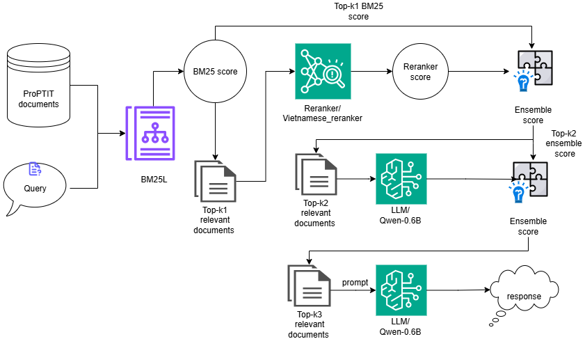

# Multiphase RAG Pipeline: **Tam Cố Thảo Lư**

## Giới thiệu 

Hệ thống **RAG Tam cố thảo lư** là một kiến trúc được thiết kế để nâng cao hiệu quả của các ứng dụng Hỏi & Đáp các thông tin về CLB ProPTIT bằng tiếng Việt. Kiến trúc này kết hợp sức mạnh của các phương pháp truy xuất thông tin truyền thống (như BM25L) với khả năng hiểu ngữ cảnh sâu sắc của các mô hình Reranker và Mô hình ngôn ngữ Lớn (LLM) như Qwen-0.6B.

Thông qua một quy trình đa tầng bao gồm truy xuất ban đầu, sắp xếp lại tài liệu, và tổng hợp điểm số thông minh (Ensemble) trước khi đưa vào LLM, hệ thống hướng tới việc cung cấp các câu trả lời chính xác, súc tích và có căn cứ trực tiếp từ nguồn dữ liệu được cung cấp. Đặc biệt, kiến trúc nhấn mạnh vai trò quan trọng của **Prompt Engineering** trong việc khai thác hiệu quả các mô hình LLM có quy mô vừa phải.

## Mô tả kiến trúc

1. Truy vấn & lọc ban đầu: Query được sử dụng cùng với kho dữ liệu ProPTIT documents để thực hiện tìm kiếm ban đầu bằng BM25L, tạo ra các tài liệu liên quan hàng đầu (Top-k1 relevant documents).
2. Sắp xếp lại & tổng hợp sơ bộ: Các tài liệu (Top-k1) này được đưa qua Reranker/Vietnamese_reranker để cải thiện thứ hạng. Điểm số BM25 và Reranker được tổng hợp (Ensemble) với trọng số alpha để tạo ra Ensemble score phase 2.
3. Xử lý bằng LLM: Các tài liệu liên quan hàng đầu (Top-k2) được đưa vào mô hình LLM/Qwen-0.6B (có thể kèm theo prompt) để xử lý sâu hơn.
Tổng hợp Cuối cùng & Tạo Phản hồi: Điểm số từ Ensemble phase 2 và kết quả từ LLM được tổng hợp lần thứ hai với trọng số belta để tạo ra một điểm số cuối cùng. Cuối cùng, LLM sử dụng thông tin này để tạo ra câu trả lời (response) cho người dùng.

## Benchmark

Hệ thống đã được đánh giá hiệu năng trên **hai bộ dữ liệu benchmark** để đo lường độ chính xác và hiệu quả.

*   **Bộ dữ liệu train:** 100 query

***Retrieval metrics***
| K | hit@k | recall@k | precision@k | f1@k | map@k | mrr@k | ndcg@k | context_precision@k | context_recall@k | context_entities_recall@k |
| - | ----- | -------- | ----------- | ---- | ----- | ----- | ------ | ------------------- | ---------------- | ------------------------- |
| 3 | 0.7   | 0.53     | 0.29        | 0.38 | 0.58  | 0.57  | 0.61   | 0.42                | 0.47             | 0.28                      |
| 5 | 0.81  | 0.61     | 0.22        | 0.32 | 0.59  | 0.6   | 0.64   | 0.4                 | 0.41             | 0.3                       |
| 7 | 0.87  | 0.68     | 0.18        | 0.28 | 0.59  | 0.61  | 0.64   | 0.32                | 0.33             | 0.33                      |

***LLM answer metrics***

| K | string_presence@k | rouge_l@k | bleu_4@k | groundedness@k | response_relevancy@k | noise_sensitivity@k |
| - | ----------------- | --------- | -------- | -------------- | -------------------- | ------------------- |
| 3 | 0.31              | 0.21      | 0.04     | 0.62           | 0.39                 | 0.44                |
| 5 | 0.31              | 0.21      | 0.04     | 0.65           | 0.42                 | 0.42                |
| 7 | 0.3               | 0.21      | 0.04     | 0.6            | 0.43                 | 0.43                |

*   **Bộ dữ liệu test:** 30 query

***Retrieval metrics***

| K | hit@k | recall@k | precision@k | f1@k | map@k | mrr@k | ndcg@k | context_precision@k | context_recall@k | context_entities_recall@k |
| - | ----- | -------- | ----------- | ---- | ----- | ----- | ------ | ------------------- | ---------------- | ------------------------- |
| 3 | 0.9   | 0.65     | 0.4         | 0.5  | 0.78  | 0.78  | 0.81   | 0.64                | 0.67             | 0.43                      |
| 5 | 0.93  | 0.74     | 0.29        | 0.41 | 0.79  | 0.79  | 0.81   | 0.46                | 0.55             | 0.48                      |
| 7 | 0.97  | 0.78     | 0.22        | 0.34 | 0.78  | 0.8   | 0.81   | 0.46                | 0.46             | 0.51                      |

***LLM answer metrics***

| K | string_presence@k | rouge_l@k | bleu_4@k | groundedness@k | response_relevancy@k | noise_sensitivity@k |
| - | ----------------- | --------- | -------- | -------------- | -------------------- | ------------------- |
| 3 | 0.33              | 0.36      | 0.12     | 0.74           | 0.39                 | 0.21                |
| 5 | 0.35              | 0.36      | 0.12     | 0.83           | 0.43                 | 0.16                |
| 7 | 0.37              | 0.33      | 0.1      | 0.78           | 0.38                 | 0.25                |
    

<!-- Bạn có thể tạo một thư mục 'results/' và lưu trữ các báo cáo benchmark chi tiết ở đó, sau đó liên kết chúng tại đây -->

## Điểm nổi bật

*   **Độ chính xác và liên quan cao:** Kết hợp nhiều lớp xử lý (BM25L, Reranker, LLM) giúp lọc và hiểu ngữ cảnh tốt hơn, dẫn đến kết quả tìm kiếm và câu trả lời chính xác hơn.
*   **Trả lời trực tiếp và súc tích:** Thay vì chỉ trả về danh sách tài liệu, hệ thống có khả năng tổng hợp thông tin và đưa ra câu trả lời trực tiếp, giúp người dùng tiết kiệm thời gian.
*   **Tối ưu hóa tài nguyên với Prompt Engineering:**
    *   Kiến trúc chứng minh rằng việc **thiết kế "prompt" chất lượng cao** cho phép các mô hình LLM nhỏ hơn (như Qwen-0.6B) đạt được hiệu suất tương đương hoặc vượt trội so với các mô hình lớn hơn trong các tác vụ cụ thể.
    *   Điều này mang lại lợi ích về **chi phí tính toán, tốc độ xử lý và khả năng triển khai linh hoạt**.
*   **Hệ thống Ensemble:** Sử dụng hai giai đoạn tổng hợp điểm số (với các trọng số `alpha` và `belta`) cho phép cân bằng linh hoạt giữa hiệu quả truy xuất ban đầu và khả năng hiểu sâu của LLM.

## Hạn chế và hướng phát triển

*   **Độ phức tạp của Pipeline:** Kiến trúc có nhiều giai đoạn, đòi hỏi quản lý và tích hợp cẩn thận các thành phần.
*   **Chất lượng Prompt:** Hiệu suất cuối cùng của hệ thống phụ thuộc đáng kể vào chất lượng và tính tối ưu của các "prompt" được tạo ra cho LLM. Việc phát triển prompt có thể tốn thời gian và công sức.
*   **Chi phí tính toán:** Mặc dù sử dụng mô hình nhỏ hơn, các bước Reranking và xử lý LLM vẫn tiêu tốn tài nguyên tính toán.

**Hướng phát triển:**

*   Nghiên cứu và tinh chỉnh các giá trị tối ưu cho hệ số `alpha` và `belta` trên nhiều bộ dữ liệu khác nhau.
*   Khám phá các kỹ thuật **Prompt Engineering nâng cao** để cải thiện hơn nữa hiệu suất của LLM.
*   Thử nghiệm các mô hình LLM và Reranker khác nhau để tìm ra sự kết hợp tối ưu cho các loại truy vấn và dữ liệu khác nhau.
